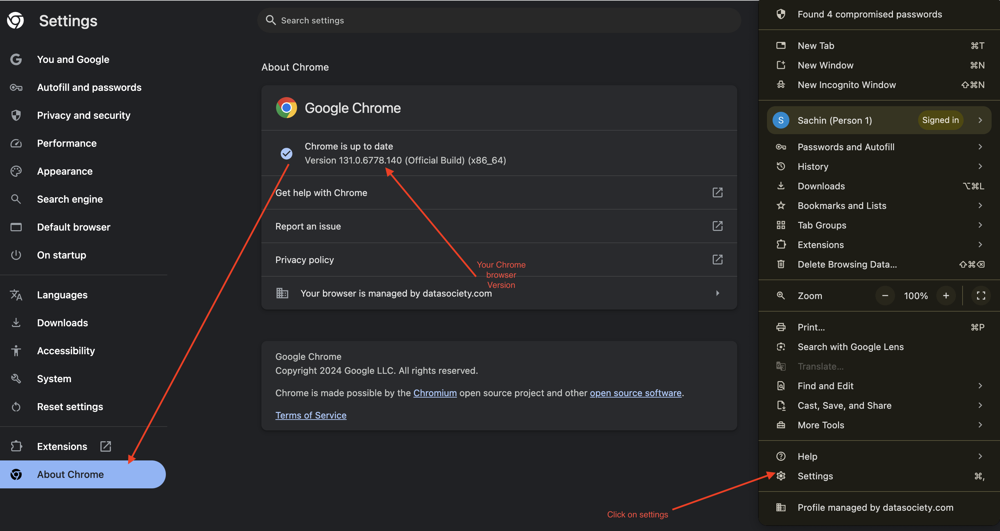
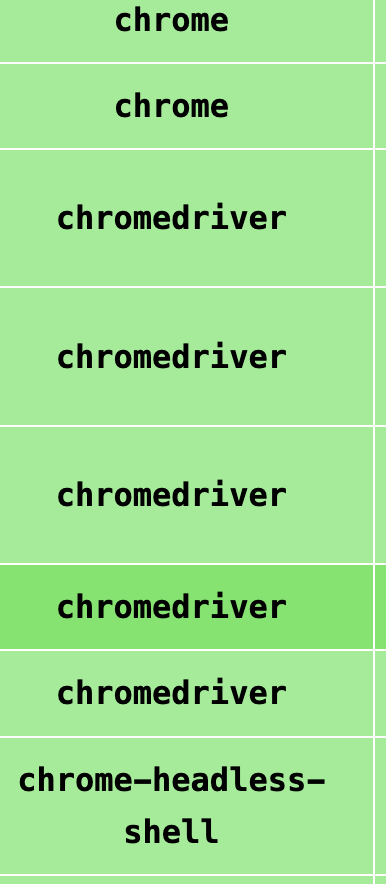
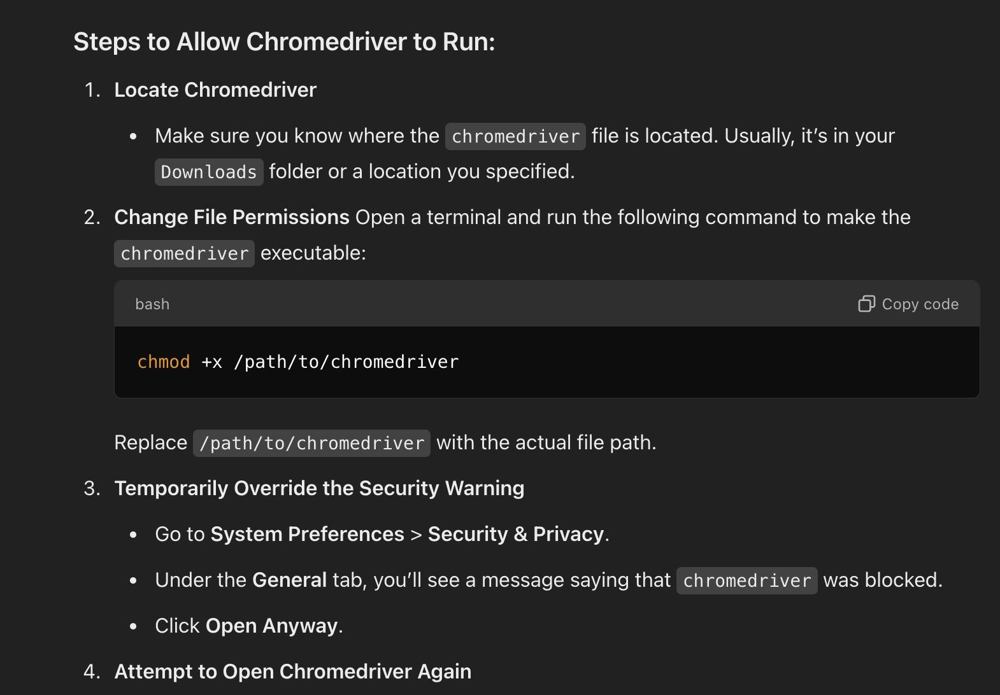

## Plagarism checker tool

## Project Dependency:

- This project requires a chromedriver and the version needs to match with your chrome browser.
- So first check your chrome browser version by doing the below steps:
- 
- Once you identify the chrome version, go to this link [Link to download chromedriver](https://googlechromelabs.github.io/chrome-for-testing/#stable) find the version of the chromedriver that matches your chrome browser version.
- Make sure your downloading the `chromedriver` and not `chrome or chrome-headless-shell`
- 

1. create virtual environment: ```conda create ```
2. activate virtual environment : ```conda activate ```
3. download all the dependencies: ```pip install -r requirements.txt```

``` streamlit run main.py```


- Once You run the application and if you see a prompt regarding `chromedriver not executable` or something related to access of the chromedriver then you can use the below image to fix it. 


