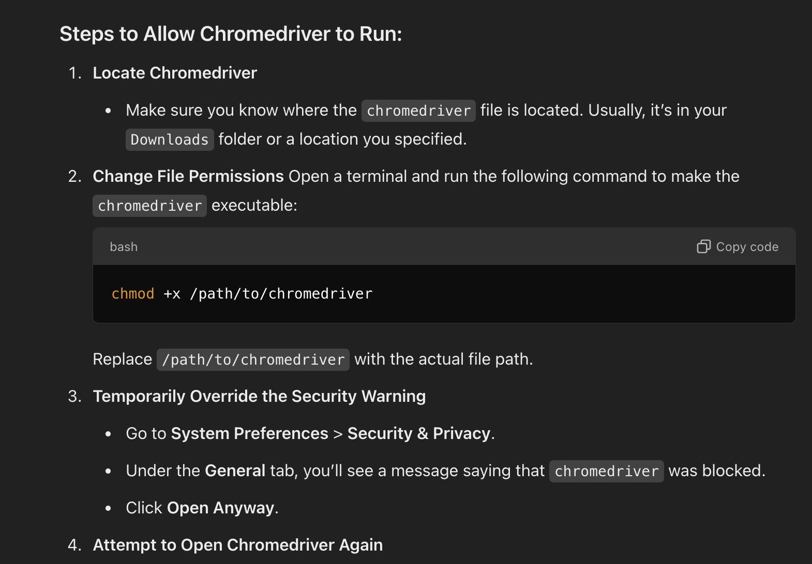

## Plagarism checker tool

## Project Dependency:

- This project requires a chromedriver and the version needs to match with your chrome browser.
- [Link to download chromedriver](https://googlechromelabs.github.io/chrome-for-testing/#stable)

1. create virtual environment: ```conda create ```
2. activate virtual environment : ```conda activate ```
3. download all the dependencies: ```pip install -r requirements.txt```

``` streamlit run main.py```




